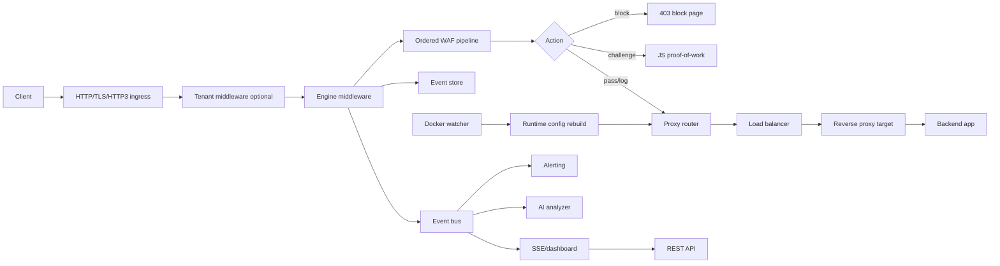

# GuardianWAF Architecture

This document describes the architecture of the GuardianWAF repository as implemented in the codebase. It is intended for maintainers, contributors, operators, and security reviewers who need to understand how the system is assembled, how requests move through it, where state is stored, and how optional subsystems plug into the core WAF engine.

## 1. Executive Summary

GuardianWAF is a Go Web Application Firewall that can run as:

- a standalone reverse proxy process (`guardianwaf serve`),
- a sidecar proxy (`guardianwaf sidecar`),
- or an embeddable Go library (`guardianwaf.New(...).Middleware(...)`).

The core runtime is built around a small set of central abstractions:

- `config.Config` is the full runtime configuration model.
- `engine.Engine` owns the WAF pipeline, event storage, event bus, statistics, access logging, challenge service integration, and hot-reloadable thresholds.
- `engine.Pipeline` executes ordered `engine.Layer` implementations.
- `engine.RequestContext` carries parsed request data, normalized values, TLS metadata, tenant metadata, findings, scores, and per-layer metadata.
- `proxy.Router`, `proxy.Balancer`, and `proxy.Target` implement host/path routing, upstream selection, reverse proxying, circuit breaking, health checking, retries, and backend SSRF protections.
- `events.EventStore` persists or buffers security events for dashboard/API/AI/alerting consumers.

The repository intentionally separates the request-processing engine from operational features such as the dashboard, MCP server, Docker discovery, alerting, AI analysis, tenant management, compliance reporting, and UI builds.

At a high level:

```text
Client
  |
  | HTTP / HTTPS / optional HTTP/3
  v
GuardianWAF ingress server
  |
  | optional tenant resolution
  v
Engine middleware
  |
  | ordered WAF pipeline
  v
Decision: pass / log / challenge / block
  |
  +--> block/challenge response
  |
  +--> reverse proxy router
          |
          +--> virtual host and path route
          +--> load balancer
          +--> target reverse proxy
          +--> upstream application

Side channels:
  Engine event store -> dashboard/API
  Engine event bus   -> SSE, alerting, AI analysis, MCP integrations
  Runtime config     -> dashboard updates, Docker discovery rebuilds, reload hooks
```

## 2. Repository Map

The repository is organized around one Go module, two React/Vite frontends, deployment assets, and extensive tests.

| Path | Role |
|---|---|
| `guardianwaf.go`, `options.go` | Public Go library API. Converts public config into internal config, creates the engine, registers the core library-mode layer subset, exposes middleware/check/stats/events. |
| `cmd/guardianwaf/` | CLI entrypoint for `serve`, `sidecar`, `check`, `validate`, setup, alert tests, healthcheck, and version output. This is where the full standalone process is wired together. |
| `internal/config/` | Configuration schema, custom YAML parser, default values, validation, serialization, environment overrides, virtual host lookup, deep copy support. |
| `internal/engine/` | Core WAF runtime: request context pooling, pipeline ordering, scoring, findings, events, stats, middleware, response wrapping, log buffering, block pages, reload hooks. |
| `internal/layers/` | WAF protection layers. Includes detection, sanitizer, rate limit, IP ACL, bot detection, CORS, API security, CRS, DLP, virtual patching, response protection, and optional advanced layers. |
| `internal/proxy/` | Reverse proxy, virtual host router, path router, load balancing, health checks, target circuit breaker, backend SSRF guard, WebSocket streaming support through `httputil.ReverseProxy`. |
| `internal/events/` | In-memory ring buffer, file-backed JSONL event storage, persistent event store, event bus. |
| `internal/dashboard/` | Dashboard HTTP server and REST API. Embeds built React assets from `internal/dashboard/dist` and legacy static files. |
| `internal/dashboard/ui/` | React 19 + Vite dashboard source. Built assets are copied into `internal/dashboard/dist` before the Go binary is built. |
| `internal/mcp/` | JSON-RPC 2.0 Model Context Protocol server, tool definitions, stdio and SSE support. |
| `internal/docker/` | Docker API client, label parser, service discovery, event watcher, polling fallback, config merge logic. |
| `internal/ai/` | AI provider catalog, provider config storage, encrypted API key persistence, batch threat analysis, token/request cost limits, optional auto-blocking. |
| `internal/ai/remediation/` | AI-generated remediation rule engine and storage. |
| `internal/alerting/` | Webhook and SMTP alert manager, cooldowns, concurrency limits, SSRF-safe webhook transport, email templating. |
| `internal/tenant/` | Multi-tenant manager, tenant middleware, per-tenant config/rules/quotas/API keys, billing, alerts, persistence, cluster-sync hooks. |
| `internal/cluster/`, `internal/clustersync/` | Cluster coordination and cluster data synchronization support. |
| `internal/tls/`, `internal/acme/` | Certificate store, hot reload, OCSP support, ACME client and challenge handling. |
| `internal/geoip/` | CSV-backed GeoIP database, lookup registration, optional auto-refresh/download. |
| `internal/discovery/` | Passive API discovery and OpenAPI-oriented schema generation. |
| `internal/analytics/` | Metrics collector and trend/geo/attack analytics engine. |
| `internal/compliance/` | PCI DSS, GDPR, SOC 2, and ISO 27001 control evaluation and hash-chained audit trail. |
| `internal/tracing/` | Lightweight tracing spans and WAF/HTTP attribute helpers. |
| `internal/http3/` | HTTP/3 server implementation behind the `http3` build tag; stub otherwise. |
| `website/` | Public documentation/marketing website, separate from the embedded dashboard. |
| `docs/` | User-facing guides, API docs, ADRs, design docs, release docs, and existing diagram-oriented architecture docs. |
| `contrib/`, `examples/` | Kubernetes/Helm/Grafana examples and sample backend/library/sidecar deployments. |
| `tests/` | E2E, integration, reliability, and Playwright suites. |
| `testdata/` | Attack payloads, benign queries, sample configurations, Docker test configuration. |

## 3. Build Variants and Dependency Boundaries

The project has two CLI source variants:

| Variant | File | Build tag | Characteristics |
|---|---|---|---|
| Default CLI | `cmd/guardianwaf/main_default.go` | `!http3` | Builds the standard CLI path without the HTTP/3 build tag. |
| HTTP/3 CLI | `cmd/guardianwaf/main.go` | `http3` | Builds the tagged CLI path. Today this file is intentionally kept byte-for-byte identical to the default CLI source except for the build tag line; `cmd/guardianwaf/build_tag_drift_test.go` enforces that constraint while runtime assembly is progressively decomposed behind smaller shared files such as `engine_runtime.go`, `event_consumers.go`, `layers.go`, `observability_runtime.go`, `clientside_runtime.go`, `challenge_runtime.go`, `dashboard_proxy_runtime.go`, `dashboard_rules_runtime.go`, `tenant_runtime.go`, `docker_runtime.go`, `ai_runtime.go`, `alerting_runtime.go`, `cleanup_runtime.go`, `serve_lifecycle.go`, `http_runtime.go`, `server_runtime.go`, `tls_runtime.go`, `dashboard_adapters.go`, `mcp_adapter_core.go`, `mcp_adapter_features.go`, `acme_runtime.go`, `geoip_runtime.go`, `rules_helpers.go`, `network_helpers.go`, `passwords.go`, and `upstreams.go`. |

The root Go module declares `github.com/quic-go/quic-go` and related indirect packages for optional HTTP/3 support. The default runtime remains structured so the core engine and most layers use the Go standard library and local packages.

Dashboard builds are a separate prerequisite for normal Go builds:

1. `make ui` runs the dashboard Vite build under `internal/dashboard/ui`.
2. The produced `dist` directory is copied to `internal/dashboard/dist`.
3. `internal/dashboard/dashboard.go` embeds `dist` with `//go:embed`.
4. `make build` then compiles `./cmd/guardianwaf`.

Important repository state note: `go list ./...` fails when `internal/dashboard/dist` is missing because of the embedded `dist` directive. `go list -e ./...` still enumerates packages and reports the dashboard embed error. Run `make ui` or `make build` before full package builds/tests in a clean checkout.

## 4. Deployment Modes

### 4.1 Standalone Reverse Proxy

`guardianwaf serve` starts the full process:

- loads YAML configuration,
- applies environment overrides,
- creates an event store through shared `cmd/guardianwaf/event_store.go`,
- creates the event bus, `engine.Engine`, WAF layer pipeline, log level, and structured access logging through shared `cmd/guardianwaf/engine_runtime.go`,
- configures the Prometheus-compatible metrics endpoint through shared `cmd/guardianwaf/observability_runtime.go`,
- mounts client-side protection report endpoints through shared `cmd/guardianwaf/clientside_runtime.go`,
- configures the optional JavaScript challenge service and verification endpoint through shared `cmd/guardianwaf/challenge_runtime.go`,
- selects the HTTP server handler through shared `cmd/guardianwaf/http_runtime.go`, including ACME challenge passthrough and HTTPS redirect hardening,
- creates HTTP server instances through shared `cmd/guardianwaf/server_runtime.go`, so serve, sidecar, and TLS listeners use the same timeout profile,
- assembles optional TLS serving, manual certificate loading, ACME account/certificate lifecycle, and certificate hot reload through shared `cmd/guardianwaf/tls_runtime.go`,
- builds a reverse proxy router, runtime fallback handler, and health checker set from `upstreams`, `routes`, and `virtual_hosts` through shared `cmd/guardianwaf/proxy_runtime.go`,
- registers liveness, readiness, and legacy health probes through shared `cmd/guardianwaf/probes.go`,
- starts health checkers,
- uses shared `cmd/guardianwaf/passwords.go` and `cmd/guardianwaf/upstreams.go` helpers for generated dashboard credentials and operator-facing upstream summaries,
- optionally starts TLS, ACME, certificate reload, HTTP redirect, and HTTP/3,
- optionally starts dashboard through shared `cmd/guardianwaf/dashboard_runtime.go`, MCP over stdio through shared `cmd/guardianwaf/mcp_runtime.go`, plus AI analysis, alerting, Docker discovery, compliance, and cleanup loops,
- wires dashboard proxy rebuild, upstream/certificate status providers, and dashboard save callbacks through shared `cmd/guardianwaf/dashboard_proxy_runtime.go`,
- wires dashboard custom-rule CRUD and dashboard GeoIP lookup through shared `cmd/guardianwaf/dashboard_rules_runtime.go`,
- initializes persisted tenant state, configured tenants, dashboard tenant management, and tenant middleware wrapping through shared `cmd/guardianwaf/tenant_runtime.go`,
- starts Docker auto-discovery and applies discovered-service proxy rebuilds through shared `cmd/guardianwaf/docker_runtime.go`,
- starts AI threat analysis, event-bus subscription, dashboard AI wiring, and optional auto-ban integration through shared `cmd/guardianwaf/ai_runtime.go`,
- starts webhook/email alerting, alert event consumers, dashboard alert stats, and MCP stdio alert-manager wiring through shared `cmd/guardianwaf/alerting_runtime.go`,
- starts periodic maintenance cleanup for rate limiting, IP ACL, ATO, and tenant rate limiter state through shared `cmd/guardianwaf/cleanup_runtime.go`,
- starts serve HTTP/TLS listeners, logs serve runtime status, and shuts down serve-mode runtime services through shared `cmd/guardianwaf/serve_lifecycle.go`,
- runs alerting and dashboard SSE event consumers through shared `cmd/guardianwaf/event_consumers.go`,
- adapts tenant billing/alert APIs into dashboard interfaces through shared `cmd/guardianwaf/dashboard_adapters.go`,
- handles graceful shutdown on signals.

Serve-mode event-bus consumers that forward events into alerting and dashboard SSE are tracked with a `WaitGroup`. On shutdown the process closes the engine, which drains the event store and closes the event bus, then waits for those forwarding goroutines with the shared shutdown context. The periodic cleanup loop is also tracked and drained before engine teardown, and serve/sidecar signal notification channels are released on return. This keeps event fan-out and maintenance workers from surviving process teardown.

This mode is language-agnostic because it sits in front of any HTTP backend.

### 4.2 Sidecar Proxy

`guardianwaf sidecar` is a lighter process intended to live beside an application container or inside the same pod. It still creates an engine and reverse proxy, but its operational surface is smaller than full standalone mode. It is optimized for a single upstream URL passed on the command line or from config.

### 4.3 Go Library Middleware

The public package at the repository root exposes:

- `New(Config, ...Option)`,
- `NewFromFile(path, ...Option)`,
- `NewWithDefaults(...Option)`,
- `Engine.Middleware(http.Handler)`,
- `Engine.Check(*http.Request)`,
- `Engine.OnEvent(func(Event))`,
- `Engine.Stats()`,
- `Engine.Close()`.

Library mode intentionally wires a smaller default layer set in `guardianwaf.go`:

1. IP ACL,
2. rate limit,
3. sanitizer,
4. detection,
5. bot detection,
6. response protection.

This keeps the embedded API compact and avoids pulling in standalone-only concerns such as dashboard, Docker discovery, MCP, and proxy routing.

## 5. Configuration Architecture

The central configuration type is `internal/config.Config`.

Top-level sections include:

- `mode`,
- `listen`,
- `tls`,
- `upstreams`,
- `routes`,
- `virtual_hosts`,
- `waf`,
- `dashboard`,
- `mcp`,
- `docker`,
- `alerting`,
- `logging`,
- `events`,
- `tenant`,
- `trusted_proxies`,
- `tracing`,
- `features`,
- `compliance`.

The `waf` subtree contains the feature-specific security configuration:

- `ip_acl`,
- `custom_rules`,
- `geoip`,
- `threat_intel`,
- `cors`,
- `rate_limit`,
- `ato_protection`,
- `api_security`,
- `api_validation`,
- `sanitizer`,
- `detection`,
- `bot_detection`,
- `challenge`,
- `response`,
- `client_side`,
- `ai_analysis`,
- `ml_anomaly`,
- `api_discovery`,
- `graphql`,
- `grpc`,
- `tenant`,
- `dlp`,
- `zero_trust`,
- `siem`,
- `cache`,
- `replay`,
- `canary`,
- `analytics`,
- `cluster_sync`,
- `cluster`,
- `remediation`,
- `websocket`,
- `crs`,
- `virtual_patch`.

Configuration loading is implemented locally instead of through a third-party YAML dependency. The custom YAML parser produces a node tree, validates known schema keys, and `PopulateFromNode` maps nodes into the strongly typed config model. The schema guard derives allowed keys from config struct `yaml` tags, rejects unknown top-level, nested struct, and sequence-item keys, and leaves map fields open for intentionally dynamic keys such as detector names, feature flags, metadata, labels, and HTTP headers.

`DefaultConfig` provides production-oriented defaults, including:

- `mode: enforce`,
- `listen: :8088`,
- TLS listen default `:8443`,
- IP ACL enabled,
- global rate limiting enabled,
- sanitizer enabled,
- six attack detectors enabled,
- detection thresholds `block: 50`, `log: 25`,
- bot detection enabled in monitor mode,
- response security headers and data masking enabled,
- dashboard enabled on `:9443`,
- MCP enabled with stdio transport,
- memory event storage with up to 100,000 events.

Runtime reload support depends on `Config.DeepCopy()`, which performs field-by-field copying of nested slices/maps. The engine stores the active config behind a mutex, exposes configuration only as defensive snapshots through `Engine.Config()`, and mirrors hot-path thresholds/body-size values into atomics. Callers that need to change runtime configuration must build a new config value and apply it through the explicit reload/save path instead of mutating the engine's live config pointer.

Reload is intentionally narrow: `Engine.Reload()` updates the engine-local config and hot-path thresholds atomically, while callers rebuild layers or proxy routers separately when route-affecting config changes. The engine test suite includes concurrent reload-with-traffic coverage so this contract stays stable.

## 6. Engine Core

### 6.1 Engine Responsibilities

`internal/engine.Engine` owns:

- the current `Pipeline` in an `atomic.Value`,
- event storage,
- event publishing,
- the optional challenge service,
- request/access statistics,
- the in-memory application log buffer,
- optional structured access log callback,
- atomic score thresholds and body-size limits,
- GeoIP readiness counters,
- active config state.

The engine deliberately defines small interfaces for `EventStorer`, `EventPublisher`, and `ChallengeChecker` so it can avoid circular imports with `events` and `layers/challenge`.

### 6.2 Request Context

`RequestContext` is allocated from a `sync.Pool` for every inspected request. It contains:

- original `*http.Request`,
- trusted client IP,
- method, URI, path, query parameters, headers, cookies, content type,
- buffered request body for inspection,
- normalized path/query/body/header values,
- score accumulator,
- current action,
- request ID and start time,
- arbitrary metadata map,
- TLS version/cipher/SNI metadata,
- JA4-related ClientHello fields when available,
- tenant ID and tenant WAF config override,
- optional tracing span.

`AcquireContext` parses request data, enforces header count limits, extracts client IP, reads and restores the request body, decompresses gzip/deflate bodies for inspection, limits decompression ratio to reduce decompression-bomb risk, records TLS metadata, and creates a score accumulator.

`ReleaseContext` clears all fields before returning the object to the pool to avoid retaining request-specific references.

### 6.3 Client IP Trust Model

Client IP extraction defaults to `RemoteAddr`. Proxy headers are ignored unless `trusted_proxies` is configured. When trusted proxies exist:

- only direct connections from trusted CIDRs can influence `X-Forwarded-For` / `X-Real-IP`,
- `X-Forwarded-For` is interpreted from the right side, choosing the rightmost non-trusted address,
- overly broad trusted proxy CIDRs are rejected.

`Engine` stores parsed trusted proxy CIDRs as instance-local state. The package-level `SetTrustedProxies` and `ExtractClientIP` helpers remain for compatibility, but `Engine.Check`, HTTP middleware, and the wired JavaScript challenge verification endpoint use `Engine.ExtractClientIP` so they share the engine-local proxy list. This prevents multiple engines in the same process from overwriting each other's trust model.

This prevents clients from spoofing security decisions through arbitrary forwarding headers.

### 6.4 Scoring and Findings

Layers return `LayerResult` values:

- `Action`,
- `Findings`,
- `Score`,
- `Duration`.

Findings include:

- detector/layer name,
- category,
- severity,
- score,
- description,
- matched value,
- location,
- confidence.

`ScoreAccumulator` clamps negative finding scores to zero, truncates evidence to 200 characters, applies a paranoia multiplier, and caps final score at 10,000. The paranoia multiplier is:

| Paranoia level | Multiplier |
|---|---:|
| 1 or lower | 0.5 |
| 2 | 1.0 |
| 3 | 1.5 |
| 4 or higher | 2.0 |

Final action is determined by both pipeline action and thresholds:

- pipeline block always blocks,
- pipeline challenge challenges unless a block already applies,
- score greater than or equal to block threshold blocks,
- score greater than or equal to log threshold logs,
- otherwise the request passes.

### 6.5 Events

`engine.NewEvent` converts request context into a durable security event. Events include:

- event ID,
- request ID,
- timestamp,
- client IP,
- method/path/query,
- action,
- score,
- findings,
- duration,
- status code,
- user agent,
- parsed browser/version/OS/device/bot flag,
- GeoIP country fields if lookup is registered,
- content type, referer, host,
- tenant ID,
- TLS and JA3/JA4 metadata.

Sensitive data is redacted at event creation time, before the event enters any store, bus, dashboard response, SSE stream, alert, AI analysis queue, MCP tool response, or library callback. The central event redaction path currently covers:

- query parameters whose names indicate credentials or security tokens, including API keys, access/refresh/id tokens, passwords, session IDs, CSRF/XSRF tokens, authorization-like parameters, cookies, JWTs, client secrets, and redirect URIs;
- referer URLs, with sensitive query values masked before the URL is stored;
- User-Agent values that contain bearer/JWT/token-like substrings;
- finding evidence that contains bearer tokens, JWT-shaped values, cookies, API keys, CSRF/XSRF tokens, session IDs, passwords, client secrets, generic secrets, or token key/value pairs.

Non-sensitive evidence remains visible so operators can still understand why a rule matched. Redaction is intentionally performed before persistence rather than only at presentation time, because event data is reused by dashboard APIs, exports, SSE, alerting, AI analysis, MCP integrations, and library-mode callbacks. Both `Engine.Check` and HTTP middleware preserve this sanitized event data instead of reassigning raw pipeline findings after event creation.

## 7. Pipeline Architecture

The pipeline is an ordered, thread-safe list of layers. It executes layers sequentially by ascending order. If a layer returns `ActionBlock`, execution stops early. Other findings are accumulated and the request continues.

Path-based detector exclusions are applied before eligible detector layers run. Paths are cleaned before matching so traversal-like path forms cannot bypass exclusions.

`internal/runtime/layerregistry` is the source of truth for the active layer names, runtime `Layer.Name()` values, and orders used for startup/debug visibility. Most entries are config-driven; the response layer is always present because it supplies response hooks even when individual response features are disabled. The registry owns construction for the current CLI WAF pipeline: IP ACL, threat intelligence, CORS, custom rules, rate limiting, ATO protection, API security, API validation, sanitizer, CRS, detection, virtual patching, DLP, bot detection, client-side protection, and response layers. The CLI assembly helper that calls the registry now lives in shared untagged `cmd/guardianwaf/layers.go`, so the default and HTTP/3 entrypoints no longer duplicate layer wiring. Event store assembly lives in shared untagged `cmd/guardianwaf/event_store.go`; event bus, engine, layer pipeline, log-level application, and structured access logging live in shared untagged `cmd/guardianwaf/engine_runtime.go`; alerting and dashboard SSE event-consumer goroutine setup lives in shared untagged `cmd/guardianwaf/event_consumers.go`; dashboard startup lives in shared untagged `cmd/guardianwaf/dashboard_runtime.go`; dashboard proxy rebuild, upstream/certificate status providers, and dashboard save callback wiring live in shared untagged `cmd/guardianwaf/dashboard_proxy_runtime.go`; dashboard custom-rule CRUD and dashboard GeoIP lookup wiring live in shared untagged `cmd/guardianwaf/dashboard_rules_runtime.go`; tenant manager persistence/config seeding, dashboard tenant registration, and tenant middleware wrapping live in shared untagged `cmd/guardianwaf/tenant_runtime.go`; Docker watcher startup and discovered-service proxy rebuilds live in shared untagged `cmd/guardianwaf/docker_runtime.go`; AI analyzer startup, event-bus subscription, dashboard AI integration, and optional auto-ban wiring live in shared untagged `cmd/guardianwaf/ai_runtime.go`; webhook/email alert manager startup, alert event consumers, dashboard alert stats, and MCP stdio alert-manager wiring live in shared untagged `cmd/guardianwaf/alerting_runtime.go`; periodic cleanup for rate limiting, IP ACL, ATO, and tenant rate limiter state lives in shared untagged `cmd/guardianwaf/cleanup_runtime.go`; serve listener startup, runtime status logging, and ordered serve-mode shutdown live in shared untagged `cmd/guardianwaf/serve_lifecycle.go`; dashboard tenant/billing/alert adapter code lives in shared untagged `cmd/guardianwaf/dashboard_adapters.go`; MCP stdio startup lives in shared untagged `cmd/guardianwaf/mcp_runtime.go`; MCP core engine adapter methods live in shared untagged `cmd/guardianwaf/mcp_adapter_core.go`; MCP feature adapter methods live in shared untagged `cmd/guardianwaf/mcp_adapter_features.go`; ACME domain collection lives in shared untagged `cmd/guardianwaf/acme_runtime.go`; TLS server assembly, manual certificate loading, ACME account/certificate lifecycle, and certificate hot reload live in shared untagged `cmd/guardianwaf/tls_runtime.go`; HTTP server timeout defaults live in shared untagged `cmd/guardianwaf/server_runtime.go`; GeoIP database loading lives in shared untagged `cmd/guardianwaf/geoip_runtime.go`; dashboard rule-map conversion lives in shared untagged `cmd/guardianwaf/rules_helpers.go`; IP/CIDR validation lives in shared untagged `cmd/guardianwaf/network_helpers.go`; proxy router assembly, runtime fallback handlers, and health-checker lifecycle helpers live in shared untagged `cmd/guardianwaf/proxy_runtime.go`; probe registration lives in shared untagged `cmd/guardianwaf/probes.go`; metrics registration lives in shared untagged `cmd/guardianwaf/observability_runtime.go`; client-side report endpoint registration lives in shared untagged `cmd/guardianwaf/clientside_runtime.go`; JavaScript challenge service setup and verification handler mounting live in shared untagged `cmd/guardianwaf/challenge_runtime.go`; HTTP handler selection, ACME redirect bypass, and HTTPS redirect hardening live in shared untagged `cmd/guardianwaf/http_runtime.go`; and small cross-cutting runtime helpers such as generated dashboard passwords and upstream summaries live in shared untagged `cmd/guardianwaf/passwords.go` and `cmd/guardianwaf/upstreams.go`. `BuildContext` carries construction-time dependencies between registered layers; for example, IP ACL construction stores the auto-ban target and rate limiting uses the same context to wire its auto-ban callback without keeping that coupling in CLI code. The same context carries the optional GeoIP database into custom rules construction while the CLI remains responsible for loading external GeoIP resources. Registry builders may also register `StartHook` lifecycle callbacks; threat intelligence uses this to keep feed refresh startup tied to the descriptor instead of concrete CLI wiring. Registry tests assert deterministic ordering, config-driven enablement, context-backed auto-ban wiring, and lifecycle hook registration, and command-package tests assert that registry runtime names and orders exactly match the engine pipeline after `addLayers` runs. `Engine.PipelineLayers()` exposes a read-only active pipeline snapshot for diagnostics and tests. The intended next step is continuing to split runtime assembly out of the large CLI files so the default and HTTP/3 entrypoints can share smaller adapters instead of duplicated full files.

### 7.1 Layer Interface

Every layer implements:

```go
type Layer interface {
    Name() string
    Process(ctx *RequestContext) LayerResult
}
```

Detector layers can also implement:

```go
type Detector interface {
    Layer
    DetectorName() string
    Patterns() []string
}
```

### 7.2 Full Layer Order Catalog

The following orders are defined in `internal/engine/layer.go`. Not every build or deployment mode wires every layer.

| Order | Constant | Layer family | Purpose |
|---:|---|---|---|
| 1 | `OrderSIEM` | SIEM | Passive forwarding/export of security events. |
| 75 | `OrderCluster` | Cluster | Distributed coordination and ban propagation. |
| 76 | `OrderWebSocket` | WebSocket | WebSocket handshake and payload security controls. |
| 78 | `OrderGRPC` | gRPC | gRPC and gRPC-Web request validation and limits. |
| 85 | `OrderZeroTrust` | Zero trust | mTLS/device/session trust checks. |
| 95 | `OrderCanary` | Canary | Stable/canary routing decision metadata. |
| 100 | `OrderIPACL` | IP ACL | CIDR whitelist/blacklist and auto-ban enforcement. |
| 125 | `OrderThreatIntel` | Threat intelligence | IP/domain reputation feed checks. |
| 140 | `OrderCache` | Cache | Optional response caching layer. |
| 145 | `OrderReplay` | Replay | Request/response recording for replay testing. |
| 150 | `OrderCORS` | CORS | Origin validation and CORS response metadata. |
| 150 | `OrderRules` | Custom rules | Configured rule conditions and actions. |
| 200 | `OrderRateLimit` | Rate limit | Token-bucket request limiting. |
| 250 | `OrderATO` | Account takeover | Brute-force, stuffing, spray, impossible-travel checks. |
| 275 | `OrderAPISecurity` | API security | JWT and API key authentication/authorization. |
| 280 | `OrderAPIValidation` | API validation | OpenAPI schema request/response validation. |
| 285 | `OrderGraphQL` | GraphQL | Query depth, complexity, aliases, introspection limits. |
| 300 | `OrderSanitizer` | Sanitizer | Normalization, size/method/header limits. |
| 310 | `OrderDiscovery` | API discovery | Passive route/schema discovery. |
| 350 | `OrderCRS` | OWASP CRS | ModSecurity/CRS-style anomaly checks. |
| 400 | `OrderDetection` | Attack detection | SQLi, XSS, LFI, CMDi, XXE, SSRF detectors. |
| 430 | `OrderChallenge` | JS challenge | Proof-of-work challenge checks. |
| 450 | `OrderVirtualPatch` | Virtual patch | CVE/NVD-derived patch rules. |
| 473 | `OrderAnomaly` | ML anomaly | ONNX/anomaly scoring. |
| 475 | `OrderDLP` | DLP | Sensitive data pattern detection and masking decisions. |
| 480 | `OrderRemediation` | AI remediation | Generated remediation rules. |
| 500 | `OrderBotDetect` | Bot detection | UA, JA3/JA4, behavior, scanner detection. |
| 590 | `OrderClientSide` | Client-side protection | Browser-side protection/CSP/report handling. |
| 600 | `OrderResponse` | Response protection | Security headers, response masking, error page mode. |

### 7.3 Library-Mode Pipeline

The public Go library adds only:

| Order | Layer |
|---:|---|
| 100 | IP ACL |
| 200 | Rate limit |
| 300 | Sanitizer |
| 400 | Detection |
| 500 | Bot detection |
| 600 | Response |

### 7.4 Default CLI Pipeline

The default CLI build wires:

- IP ACL,
- threat intelligence,
- CORS,
- custom rules,
- rate limiting,
- ATO protection,
- API security,
- API validation,
- sanitizer,
- CRS,
- detection,
- virtual patching,
- DLP,
- bot detection,
- client-side protection,
- response protection.

### 7.5 HTTP/3 Build Pipeline

The `http3` build variant wires the default CLI functionality plus additional advanced layers:

- SIEM,
- cluster,
- WebSocket,
- gRPC,
- zero trust,
- canary,
- replay,
- cache,
- GraphQL,
- API discovery,
- ML anomaly,
- AI remediation,
- explicit HTTP/3 ingress support.

## 8. Request Lifecycle

### 8.1 Standalone Proxy Request

1. The HTTP, HTTPS, or optional HTTP/3 server accepts a request.
2. If tenant mode is enabled, tenant middleware resolves tenant identity by API key, domain, or default tenant policy.
3. `engine.Middleware` starts panic recovery.
4. The engine snapshots optional challenge and access-log callbacks.
5. A pooled `RequestContext` is acquired and populated.
6. Tenant config override metadata is attached if present.
7. Tracing span is started if tracing is enabled and sampled.
8. The current pipeline is executed.
9. Layer findings and scores are accumulated.
10. The engine computes the final action from pipeline action plus thresholds.
11. If the final action is `challenge`, the challenge cookie is checked. A valid cookie downgrades the request to `pass`.
12. An `Event` is created.
13. Response hooks from CORS and response layers are applied.
14. Optional response masking function is captured.
15. Context is released back to the pool.
16. Runtime stats are updated.
17. The event is stored and published.
18. Access log callback is invoked if configured.
19. Correlation headers are set:
    - request: `X-Correlation-ID`,
    - response: `X-GuardianWAF-RequestID`.
20. Final action is enforced:
    - `block`: return branded 403 block page,
    - `challenge`: return JS proof-of-work challenge page if service exists; otherwise block,
    - `log` or `pass`: call the downstream handler.
21. In standalone mode, the downstream handler is the reverse proxy router.
22. If response masking is active, the response writer buffers/masks text before flushing.

### 8.2 Library Request

Library mode follows the same engine middleware path, but the downstream handler is the application-provided Go `http.Handler` instead of GuardianWAF's reverse proxy router.

### 8.3 Dry-Run Check

`Engine.Check` runs the pipeline and creates an event-like result without proxying. It is useful for CLI checks, tests, and library users that want to evaluate requests manually.

## 9. Reverse Proxy Architecture

The proxy subsystem is in `internal/proxy`.

### 9.1 Routing

`Router` supports:

- exact virtual host matches,
- wildcard virtual host matches such as `*.example.com`,
- default routes when no virtual host matches,
- longest path-prefix matching,
- optional prefix stripping.

Host matching strips ports and lowercases hostnames. Wildcard routes are sorted by suffix length so the most specific wildcard wins.

### 9.2 Load Balancing

Each route points to a `Balancer`. Supported strategies are:

- `round_robin`,
- `weighted`,
- `least_conn`,
- `ip_hash`.

Only healthy targets are considered. If no healthy targets exist, the router returns `503`.

Weighted balancing is implemented as expanded weighted round-robin by cumulative weight. `least_conn` uses per-target active connection counters. `ip_hash` hashes the direct remote address for stable target selection.

### 9.3 Target Proxying

`Target` wraps `httputil.ReverseProxy` and adds:

- backend URL and weight,
- active connection accounting,
- health flag,
- circuit breaker,
- custom transport timeouts,
- immediate flushing for streaming/chunked/SSE/WebSocket-like traffic,
- hop-by-hop and spoofable forwarded-header cleanup,
- correlation ID propagation,
- proxy error capture for router retries.

On proxy errors, the target records circuit-breaker failure and allows the router to retry another target. Responses below HTTP 500 record success; HTTP 500+ records failure.

### 9.4 Circuit Breaker

Every target owns a circuit breaker. If the circuit is open, the target returns `503 Service Unavailable - Circuit breaker open`. Healthy checks and successful responses can reset the circuit.

### 9.5 Health Checking

`HealthChecker` periodically probes each target:

- default interval: 10 seconds,
- default timeout: 3 seconds,
- default path: `/`,
- success status range: `200 <= status < 400`.

Health checks re-run backend SSRF validation before probing, reducing DNS rebinding risk.

Health-check HTTP clients use the same connection-time SSRF-safe dialer as the reverse proxy transport, explicit TLS handshake and response-header timeouts, and no automatic redirect following. A 3xx response from the configured health endpoint can still be considered healthy, but GuardianWAF does not follow the redirect to prove health at a different location.

Health checkers are owned by the active proxy/router generation. Shutdown stops them explicitly, and runtime proxy rebuilds stop the replaced generation after the new handler has been atomically installed. `Stop` also cancels any in-flight probe request before waiting for the worker goroutine. This prevents stale health probe loops from surviving dashboard or Docker-discovery route changes and avoids long shutdown waits caused by backend probe timeouts.

### 9.6 Runtime Probes

The proxy listener exposes unauthenticated operational probes before request traffic is passed through the WAF middleware:

- `/livez` returns process liveness.
- `/readyz` returns readiness and reports `503 Service Unavailable` when any configured upstream group has zero healthy targets.
- `/healthz` remains as a backward-compatible liveness-style endpoint for existing deployments.

Kubernetes and Helm examples should use `/livez` for liveness probes and `/readyz` for readiness probes. Deeper dependency readiness, such as event store, GeoIP, and dashboard state, should be added without changing the basic endpoint split.

### 9.7 Backend SSRF Guard

`proxy.NewTarget` rejects upstream targets that resolve to:

- unspecified addresses,
- loopback,
- private IPs,
- link-local unicast/multicast,
- interface-local multicast.

The custom dialer resolves and validates IPs at connection time, then dials the validated IP directly. This closes the time-of-check/time-of-use gap from DNS rebinding. Runtime deployments can opt into private/service-network upstreams through the explicit top-level `allow_private_upstreams` config key or the `GWAF_ALLOW_PRIVATE_UPSTREAMS` environment variable. Tests can still opt in at construction time through `proxy.AllowPrivateTargets()`.

## 10. Security Layers

### 10.1 IP ACL

IP ACL provides whitelist, blacklist, and auto-ban enforcement. CIDR matching is implemented with radix-oriented structures for efficient network lookup. Auto-ban can be driven by other layers and AI analysis through an `IPBlocker` interface.

### 10.2 Threat Intelligence

Threat intelligence loads reputation feeds and checks request IP/domain indicators. Feeds can be JSONL, CSV, or JSON-oriented depending on configuration. The layer supports cache and refresh behavior and contributes findings/actions before heavier request inspection.

### 10.3 CORS

CORS validates `Origin`, supports allow lists and wildcard patterns, handles preflight metadata, and stores headers in request context metadata. The engine applies these headers before response hooks so CORS and response protection can cooperate without circular package dependencies.

### 10.4 Custom Rules

Custom rules are configured with:

- ID,
- name,
- enabled flag,
- priority,
- conditions,
- action,
- score.

Conditions can inspect fields such as path, method, IP, country, headers, user agent, and other request attributes. The rules layer can receive a GeoIP database for country-aware matching.

### 10.5 Rate Limiting

Rate limiting uses token buckets. Rules define:

- ID,
- scope,
- paths,
- limit,
- window,
- burst,
- action,
- optional auto-ban threshold.

It runs before heavier detectors to reduce expensive processing under abuse.

### 10.6 Account Takeover Protection

ATO protection watches configured login paths and detects:

- brute force,
- credential stuffing,
- password spray,
- impossible travel.

It is designed to combine request patterns, login outcomes, GeoIP state, and thresholds.

### 10.7 API Security

API security supports:

- JWT validation,
- multiple algorithms,
- JWKS integration,
- API key authentication,
- path/scoping authorization,
- skip paths.

It runs before schema validation and detection so authentication failures can be handled early.

### 10.8 API Validation

API validation validates traffic against OpenAPI-style schemas. It can validate requests and responses, operate in strict or monitor modes, and optionally block on schema violations.

### 10.9 GraphQL Security

GraphQL protection limits:

- query depth,
- query complexity,
- introspection,
- alias count,
- allowed endpoints.

It is wired in the HTTP/3 build variant.

### 10.10 Sanitizer

The sanitizer enforces request-shape limits and normalization:

- URL length,
- total header size,
- header count,
- body size,
- cookie size,
- allowed methods,
- null-byte blocking,
- hop-by-hop header stripping,
- path-specific overrides,
- encoding normalization.

Normalized values are stored in `RequestContext` for downstream detectors.

### 10.11 OWASP CRS

The CRS layer implements ModSecurity/OWASP CRS-style anomaly checks. It has paranoia level, anomaly threshold, rule path, exclusions, and disabled-rule configuration.

### 10.12 Detection Layer

The detection layer coordinates six attack detectors:

- SQL injection,
- cross-site scripting,
- local file inclusion/path traversal,
- command injection,
- XML external entity injection,
- server-side request forgery.

Each detector can be enabled/disabled and score-scaled by multiplier. Exclusions can skip named detectors for specific path prefixes.

The SQL injection detector uses tokenizer-based analysis rather than simple raw regex matching. Detectors scan path, query, body, cookies, selected headers, and content-type-specific inputs depending on detector type.

### 10.13 Virtual Patching

Virtual patching can load or generate CVE/NVD-derived rules. It is intended to block or score exploit patterns while upstream applications are being patched.

The NVD client treats the feed URL as SSRF-sensitive. Custom base URLs are preflight validated, redirect targets are revalidated, and the HTTP transport validates resolved IPs again at dial time to reduce DNS rebinding risk.

### 10.14 ML Anomaly

The anomaly layer uses request feature extraction and ONNX-oriented model support to flag behavior that differs from observed baseline traffic. It is wired in the HTTP/3 build path.

### 10.15 DLP

DLP scans request and response bodies for sensitive data patterns such as credit cards, SSNs, API keys, private keys, and tax IDs. It can block on match and/or mask response data.

### 10.16 AI Remediation

AI remediation consumes generated rules and applies them as a later-stage protection layer after anomaly/DLP-oriented analysis. It has confidence thresholds, rule TTL, excluded paths, and daily rule limits.

### 10.17 Bot Detection

Bot detection includes:

- User-Agent parser,
- empty/known-scanner blocking,
- TLS fingerprint handling,
- JA3/JA4-oriented metadata,
- behavioral request tracking,
- optional enhanced biometric/fingerprint/captcha subpackages.

The main package registers the bot User-Agent parser with the engine at startup to avoid import cycles.

### 10.18 Challenge

The challenge service provides JavaScript proof-of-work challenges. The engine checks challenge cookies only after the pipeline decides the request should be challenged. Valid challenge cookies downgrade challenge to pass.

### 10.19 Client-Side Protection

Client-side protection supports browser-side monitoring/reporting, CSP-related behavior, skimming-domain controls, and dashboard/API management for client-side security state.

### 10.20 Response Protection

The response layer registers response hooks and masking functions through request context metadata. It can apply:

- HSTS,
- `X-Content-Type-Options`,
- `X-Frame-Options`,
- referrer policy,
- permissions policy,
- data masking,
- stack trace stripping,
- production-mode error page behavior.

## 11. Ingress, TLS, ACME, and HTTP/3

Standalone mode can start separate HTTP and TLS servers. TLS configuration supports:

- global certificates,
- per-virtual-host certificates,
- SNI-based certificate selection,
- HTTP-to-HTTPS redirect,
- ACME-managed certificates,
- certificate cache directory,
- certificate hot reload.

`internal/tls` provides certificate store and OCSP support. `internal/acme` provides ACME client and challenge handling.

HTTP/3 support lives behind the `http3` build tag. When enabled, the CLI can start an HTTP/3 server and advertise `Alt-Svc` according to config. The Go module includes `quic-go` for this optional path.

## 12. Events, Observability, and Runtime State

### 12.1 Event Stores

`events.EventStore` supports:

- `Store`,
- `Query`,
- `Get`,
- `Recent`,
- `Count`,
- `Close`.

Implemented stores include:

- memory ring buffer,
- async JSONL file store with rotation,
- persistent store variants.

The memory store supports query/filter/sort/pagination. Runtime `events.storage: file` uses the persistent memory store: startup replays the configured JSONL file into the queryable memory ring and appends new events back to the file. The lower-level async file store is optimized for append and durability and does not support query APIs directly. File-backed stores guard close paths explicitly: async JSONL writes cannot race with channel closure, and persistent memory-store appends serialize file writes against file close.

Container and Kubernetes packaging reserves `/var/lib/guardianwaf` for durable application state and `/var/log/guardianwaf` for file-backed event/log output. The Helm chart can back those paths with a PVC; the static Kubernetes examples use `emptyDir` so read-only-root examples remain runnable without requiring a storage class.

Event stores are expected to receive already-sanitized `engine.Event` values. They do not perform presentation-layer redaction themselves, which keeps memory, JSONL, persistent stores, dashboard APIs, and event-bus consumers on the same privacy contract.

### 12.2 Event Bus

The event bus publishes `engine.Event` values to subscribers. Consumers include:

- dashboard SSE,
- AI analyzer,
- alerting manager,
- MCP-backed operations,
- any library-mode `OnEvent` callback.

### 12.3 Metrics and Stats

Engine stats are atomic counters:

- total requests,
- blocked requests,
- challenged requests,
- logged requests,
- passed requests,
- average latency,
- GeoIP readiness/range count.

The dashboard exposes stats through REST endpoints and can expose Prometheus-compatible metrics.

### 12.4 Logs

The engine has an in-memory `LogBuffer` for dashboard visibility. Standalone mode also configures structured access logging through an injected callback. Access log entries contain request metadata, action, score, duration, finding count, request ID, and tenant ID. Access logs use URL path without query parameters, do not include request bodies or finding evidence, and receive the same redacted User-Agent value that is stored on the event.

### 12.5 Tracing

Tracing is package-local and lightweight. When enabled and sampled:

- the engine starts a root request span,
- each pipeline layer creates a child span,
- spans carry HTTP method/URL/host/user agent and WAF layer/action/score metadata.

Trace URL attributes redact sensitive query parameters, and trace User-Agent attributes redact bearer/JWT/token-like substrings before span emission.

## 13. Dashboard and REST API

The dashboard is an HTTP server in `internal/dashboard`.

It serves:

- login/logout pages,
- React SPA routes,
- embedded Vite assets from `internal/dashboard/dist`,
- legacy static assets from `internal/dashboard/static`,
- REST API endpoints under `/api/v1`,
- SSE stream,
- localhost-only pprof endpoints,
- compliance endpoints,
- AI, alerting, Docker, routing, events, logs, rules, IP ACL, SSL, and config endpoints.

Authentication supports:

- API key header (`X-API-Key`),
- browser sessions,
- tenant-scoped API keys,
- separate admin key for cross-tenant operations.

Query-string API keys are intentionally rejected so credentials do not leak through URLs, access logs, referrers, browser history, or dashboard event evidence. Browser-driven streams use the authenticated dashboard session cookie; non-browser API clients must send `X-API-Key`.

The normal dashboard API key keeps first-run ergonomics: if `dashboard.api_key` is empty, startup generates a strong random key and prints it for the operator. The cross-tenant system admin key is stricter: `dashboard.admin_key` or `GWAF_DASHBOARD_ADMIN_KEY` must be explicitly configured, otherwise tenant-admin endpoints remain disabled and return unauthorized. Startup logs a warning instead of generating and printing an ephemeral admin key.

Security controls include:

- constant-time API key comparisons,
- login rate limiting and lockout,
- session refresh,
- CSRF validation for cookie-authenticated state-changing requests,
- admin-only endpoint restrictions for tenant API keys,
- pprof restricted to loopback `RemoteAddr`.

Dashboard APIs avoid returning stored credential material unless the endpoint is explicitly a one-time secret issuance path:

- AI provider configuration reads return provider/model/base URL metadata plus `api_key_set` and a generic mask; they do not return the AI provider key itself.
- AI provider keys are encrypted on disk by the AI store when encryption is enabled, including the auto-generated store key path.
- Tenant admin tenant objects are sanitized before list/create/get/update responses: stored tenant `api_key_hash` fields are removed, and nested dashboard `api_key`/`admin_key` config values are redacted.
- Tenant API keys are returned only by explicit create/regenerate-key responses, where the caller must capture the new key because only the hash is retained afterward.

The dashboard receives callbacks for:

- upstream status,
- config rebuild,
- config save,
- rule operations,
- GeoIP lookup,
- alerting stats,
- AI analyzer,
- Docker watcher,
- tenant manager,
- certificate status,
- compliance engine.

This callback design avoids making the dashboard package own the runtime subsystems.

## 14. MCP Server

The MCP server implements JSON-RPC 2.0 and exposes GuardianWAF operations as tools. It supports:

- stdio transport,
- SSE transport,
- optional API-key authentication during initialize,
- tool listing,
- tool calls.

The server depends on an `EngineInterface`, not on concrete engine/dashboard types. Tool families include:

- stats,
- events,
- whitelist/blacklist,
- rate limits,
- exclusions,
- mode/config,
- detector information,
- test requests,
- alerting management,
- CRS management,
- virtual patching,
- API validation,
- client-side protection,
- DLP,
- HTTP/3 status/config.

## 15. Docker Auto-Discovery

Docker discovery converts labeled containers into GuardianWAF upstreams/routes.

Relevant labels use the `gwaf` prefix by default:

- `gwaf.enable`,
- `gwaf.host`,
- `gwaf.path`,
- `gwaf.port`,
- `gwaf.weight`,
- `gwaf.strip_prefix`,
- `gwaf.lb`,
- `gwaf.upstream`,
- `gwaf.tls`,
- `gwaf.health.path`,
- `gwaf.health.interval`.

The watcher:

- performs an initial sync,
- attempts Docker event streaming,
- falls back to polling,
- maintains a discovered service map,
- calls an injected `onChange` callback when services change.

`BuildConfig` merges discovered services with static config:

- groups services by upstream name,
- skips discovered upstreams if a static upstream with the same name exists,
- creates target URLs from container IP/port,
- adds virtual host routes when `gwaf.host` is present,
- otherwise adds default routes.

The Docker watcher logs a warning when the Docker socket is mounted because Docker socket access is a high-privilege boundary.

## 16. AI Threat Analysis

The AI subsystem is optional and background-oriented.

### 16.1 Provider Catalog

`CatalogCache` fetches provider/model information from a catalog URL, defaulting to `https://models.dev/api.json`. Fetching has:

- HTTPS warning for insecure catalog URLs,
- SSRF checks against private/loopback destinations before the request,
- redirect target validation,
- connection-time DNS/IP validation to reduce DNS rebinding risk,
- 30-second timeout,
- explicit dial, TLS handshake, response-header, and idle connection timeouts,
- 5 MB response limit,
- stale-cache fallback.

### 16.2 Store

`ai.Store` persists:

- selected provider/model/base URL/API key,
- analysis history,
- usage counters.

API keys are encrypted at rest with AES-256-GCM using an auto-generated local key file, with support for a dashboard-derived encryption key.

### 16.3 Analyzer

The analyzer subscribes to WAF events and collects suspicious events above `MinScoreForAI`. It flushes batches by size or interval. It enforces:

- max tokens per hour,
- max tokens per day,
- max requests per hour.

The AI prompt asks for JSON verdicts. Results are parsed and stored. If auto-blocking is enabled, high-confidence `block` verdicts can add temporary IP auto-bans through the `IPBlocker` interface.

## 17. Alerting

Alerting supports webhooks and SMTP email.

Webhook manager features:

- Slack, Discord, generic, and PagerDuty-oriented payloads,
- event filters,
- minimum score filters,
- per-IP cooldowns,
- concurrency semaphore,
- WaitGroup-backed shutdown draining for in-flight webhook/email sends,
- SSRF-safe HTTP transport,
- rejection of invalid/private webhook URLs by default,
- sent/failed counters.

Email manager features:

- SMTP with optional TLS,
- optional authentication,
- custom subject/body templates,
- CRLF stripping to prevent header injection,
- control-character stripping for template values,
- per-IP cooldowns,
- email sent/failed counters.

Alerting consumes events asynchronously so request processing is not blocked by slow outbound notifications. During process shutdown, the manager stops accepting new dispatches, waits for in-flight webhook/email sends until the shared shutdown context expires, and closes idle HTTP connections before the engine closes the event bus and store.

## 18. Multi-Tenancy

The tenant subsystem provides namespace isolation for hosted use cases.

Each tenant has:

- ID,
- name/description,
- active flag,
- API key hash,
- domains,
- quotas,
- isolated `config.Config`,
- usage counters.

Tenant resolution priority:

1. `X-GuardianWAF-Tenant-Key`,
2. domain match,
3. default tenant or rejection depending on policy.

Tenant middleware:

- rejects missing/unmatched tenants when required,
- rejects inactive tenants,
- checks quotas,
- attaches tenant context to the request,
- attaches `engine.TenantContext` for WAF config overrides,
- tracks response status and byte counts.

The manager also owns:

- tenant-specific rules,
- billing manager,
- alert manager,
- persistence store,
- cluster-sync broadcast hook.

## 19. GeoIP

GeoIP support loads a CSV database and registers an engine-level lookup callback. Events can then be enriched with country code/name. GeoIP can auto-download/refresh the database when configured. Custom rules can use GeoIP for country-aware matching.

GeoIP auto-download treats the configured database URL as SSRF-sensitive. Downloads reject private/loopback/link-local destinations before the request, validate redirect targets, validate resolved IPs again at dial time, use explicit dial/TLS/response-header/whole-request timeouts, and cap downloaded bytes before writing to disk.

## 20. Compliance and Analytics

### 20.1 Compliance

The compliance engine maps WAF capabilities and metrics to controls for:

- PCI DSS,
- GDPR,
- SOC 2,
- ISO 27001.

It evaluates metrics against criteria, generates framework reports, and can maintain a hash-chained JSONL audit trail. The audit chain starts from `genesis` or replays persisted entries at startup.

### 20.2 Analytics

The analytics engine works over a collector and provides:

- traffic totals,
- blocked/allowed/challenged counts,
- block percentage,
- average/p95/p99 latency,
- requests per second,
- attack type breakdown,
- trend analysis,
- geographic distribution.

## 21. Frontend Architecture

### 21.1 Embedded Dashboard UI

Dashboard UI stack:

- React 19,
- Vite 6,
- TypeScript,
- React Router 7,
- Tailwind CSS 4,
- lucide-react,
- React Flow via `@xyflow/react`,
- Vitest/testing-library tests.

Routes include:

- dashboard,
- routing,
- rules,
- config,
- alerting,
- SSL,
- AI,
- compliance,
- logs,
- tenants,
- tenant detail/analytics,
- clusters.

The dashboard is built into static assets and embedded into the Go binary.

### 21.2 Public Website

The `website/` app is a separate React/Vite project for public pages and docs. It is not embedded into the runtime binary.

## 22. Testing and Quality Gates

The repository contains:

- unit tests across core packages,
- fuzz tests for config, sanitizer, SQLi, XSS, and IP ACL areas,
- integration tests under `tests/integration`,
- E2E tests under `tests/e2e`,
- Playwright tests for dashboard workflows,
- reliability tests,
- attack simulation scripts,
- smoke tests,
- benchmark scripts.

Make targets:

- `make build`: dashboard UI + Go binary,
- `make dev`: Go-only build, skips dashboard rebuild,
- `make test`: `go test -race -count=1 ./...`,
- `make cover`: race + coverage profile,
- `make fuzz`: selected fuzz suites,
- `make e2e`: Playwright E2E against a running server,
- `make docker-test`: Docker Compose integration test,
- `make smoke`: binary smoke tests.

Because `internal/dashboard/dist` is embedded, a clean checkout should run `make ui` before full `go test ./...` or `make test`.

## 23. Operational Data Flow



## 24. Runtime State and Concurrency Model

Important concurrency choices:

- The active pipeline is read from `atomic.Value`.
- Pipeline layer slices are protected by `sync.RWMutex`.
- Request contexts are pooled.
- Engine counters are atomics.
- Hot-path thresholds/body size are atomics.
- Engine config and callbacks are mutex-protected.
- Memory event store uses `sync.RWMutex`.
- File event store uses a buffered channel plus a writer goroutine.
- Alerting uses async goroutines limited by a semaphore.
- Docker watcher uses a map protected by `sync.RWMutex` and change callbacks.
- Tenant manager uses manager-level and tenant-level locks.
- Health checkers, AI analyzers, and serve-mode cleanup loops run background goroutines with stop channels and wait groups.

Panic recovery exists in:

- engine middleware,
- health checker,
- Docker watcher loop,
- AI analyzer loop,
- alert callback paths.

## 25. Security-Sensitive Boundaries

### 25.1 Trusted Proxies

Proxy headers influence client IP only when the direct peer is in `trusted_proxies`. This is a critical deployment setting when GuardianWAF sits behind a load balancer.

### 25.2 Backend Targets

Static upstreams and discovered Docker targets are validated against private/reserved IP rules unless `allow_private_upstreams` is explicitly enabled or test code opts into private targets. Operators deploying inside private networks need to understand this guard because it is intentionally strict by default.

### 25.3 Dashboard API

Dashboard API keys should be treated as administrative credentials. Tenant API keys are scoped and blocked from admin-only prefixes. Cookie-authenticated state-changing operations use same-origin CSRF checks.

### 25.4 Docker Socket

Mounting `/var/run/docker.sock` gives GuardianWAF visibility into container configuration and topology and is a privilege boundary. Production deployments should prefer safer Docker connectivity patterns, such as TLS-based Docker access where supported.

The direct Docker HTTP client uses a Unix-domain socket dialer rather than TCP. It still has explicit whole-request, response-header, expect-continue, and idle connection timeouts so Docker API polling cannot hang indefinitely.

### 25.5 AI Provider Configuration

AI catalog URLs and provider base URLs are SSRF-sensitive. The AI catalog fetch path rejects private/loopback catalog destinations by default, validates redirects, validates resolved IPs at dial time, uses explicit transport timeouts, and stores API keys encrypted on disk.

AI provider calls use the same default-deny posture for private/loopback endpoints unless a test-only/private-endpoint override is explicitly set. The provider HTTP client validates redirect targets, validates resolved IPs at dial time, enforces TLS 1.2 or newer, and uses explicit dial/TLS/response-header/whole-request timeouts.

### 25.6 API Security JWKS

JWKS URLs are security-sensitive because they control JWT verification keys. JWKS configuration rejects private, loopback, link-local, localhost, `.local`, `.localhost`, and `.internal` targets; each fetch also uses connection-time DNS/IP validation, redirect target validation, bounded response reads, and explicit dial/TLS/response-header/whole-request timeouts. Local JWKS endpoints are only allowed in tests that explicitly bypass startup SSRF validation.

### 25.7 Webhooks

Webhook URLs are validated to avoid private/loopback targets by default. Outbound webhook sends are asynchronous and bounded. Redirect targets are validated with the same policy, and the webhook client uses connection-time SSRF validation plus explicit dial/TLS/response-header/expect-continue timeouts.

### 25.8 SIEM Exporter

SIEM endpoints are treated as public, security-sensitive outbound destinations. Endpoint configuration requires HTTPS, rejects private/loopback/link-local/internal hosts, validates DNS during configuration, validates resolved IPs again at dial time, validates redirect targets, enforces TLS certificate verification, and uses explicit dial/TLS/response-header/whole-request timeouts.

### 25.9 Threat Intelligence Feeds

Threat intelligence feed URLs can directly influence block decisions. URL feeds reject private/loopback/link-local destinations by default, validate redirects, validate resolved IPs at dial time, enforce TLS verification, use explicit dial/TLS/response-header/whole-request timeouts, and cap parsed entries and response sizes. Private feed URLs are only allowed through a non-config-file testing override.

### 25.10 CVE/NVD Feeds

Virtual patch NVD feeds use the same default-deny posture for private, loopback, link-local, unspecified, and multicast targets. This validation happens before accepting a custom feed URL, on redirects, and again when the client resolves and dials the destination.

### 25.11 Cluster Coordination And Sync

Cluster coordination and cluster sync are different from public outbound integrations: peer nodes are expected to live on private service networks. The cluster sync URL validator therefore permits private peer addresses while still rejecting malformed schemes, empty hosts, link-local targets, and unspecified addresses. Plain HTTP is rejected outside tests so the shared cluster secret is not transmitted in cleartext.

Cluster coordination and cluster sync HTTP clients do not follow redirects. Cluster API calls should terminate at the configured peer endpoint; following redirects would let a peer move replication traffic to an unexpected destination. Both clients use explicit dial, TLS handshake, response-header, and whole-request timeouts.

### 25.12 OCSP Responders

OCSP responder URLs are extracted from certificate AIA extensions. They are treated as certificate-provided outbound URLs: the client keeps a short whole-request timeout, explicit dial/TLS/response-header timeouts, and does not follow redirects. Internal CA OCSP responders may be private, so private-address blocking is not applied at this layer; operators should restrict certificate sources and outbound firewall policy accordingly.

### 25.13 CAPTCHA Verification

hCaptcha and Cloudflare Turnstile verification calls go to fixed provider endpoints. The verification clients use explicit dial, TLS handshake, response-header, and whole-request timeouts, and they do not follow redirects. Provider verification endpoints should not redirect verification POSTs; refusing redirects prevents a compromised or intercepted response path from moving token verification traffic to an unexpected destination.

### 25.14 ACME Certificate Authority Calls

ACME directory, nonce, account, order, authorization, challenge, finalize, and certificate-fetch calls use an explicit HTTP transport with dial, TLS handshake, response-header, and whole-request timeouts. The client does not follow redirects. ACME requests are signed with the target URL embedded in the protected JWS header, so following redirects would either invalidate the request or move certificate-management traffic to an endpoint the operator did not configure.

Production ACME configuration should use HTTPS CA directory URLs. Local HTTP URLs remain usable for mock ACME tests and isolated development harnesses.

### 25.15 Replay Targets

Replay intentionally sends recorded requests to operator-configured targets, which are often staging, internal, or isolated validation environments. The replay client therefore does not block private networks. It does use explicit dial, TLS handshake, response-header, and whole-request timeouts. Redirect following remains an explicit replay configuration option and is disabled by default.

### 25.16 Canary Health Checks

Canary health checks target operator-configured stable/canary upstreams, which are commonly internal service addresses. Private networks are allowed for this path. Health checks use explicit dial, TLS handshake, response-header, and whole-request timeouts and do not follow redirects. A canary health endpoint should prove the configured upstream is healthy directly; a redirect is treated as a non-success response rather than as proof that another endpoint is healthy.

### 25.17 Event Redaction

Sensitive query parameter values are redacted before events are stored. Request bodies may still contain sensitive data depending on logging/configuration; response masking and DLP should be configured for environments that process regulated data.

## 26. Extension Points

Common extension paths:

- Add a WAF layer by implementing `engine.Layer`, adding a descriptor and builder in `internal/runtime/layerregistry`, and extending the shared `cmd/guardianwaf/layers.go` assembly tests if the new layer introduces dependencies or lifecycle hooks.
- Add a detector by implementing detector logic under `internal/layers/detection` and exposing config mapping through `config.DetectorConfig`.
- Add a dashboard endpoint by registering a handler in `dashboard.New` and adding matching UI/API client code.
- Add an MCP tool by extending `EngineInterface`, registering a handler, and adding a tool definition.
- Add Docker labels by updating `docker.ParseLabels`, `DiscoveredService`, and config merge behavior.
- Add config fields by updating `config.Config`/sub-config structs, defaults, parser population, validation, serialization, and docs.
- Add observability by subscribing to the event bus or extending access log/tracing attributes.

When adding pipeline behavior, preserve these rules:

- low-cost early blockers should run before expensive detection,
- response mutators should run late,
- passive observers should not block unless explicitly configured,
- layers should be deterministic and avoid long external I/O in the request path,
- metadata keys should be named carefully to avoid collisions.

## 27. Known Architectural Caveats

- The root `guardianwaf.yaml`, major example configs, and static Kubernetes ConfigMaps are now covered by fixture validation. Remaining docs snippets and generated deployment examples should continue to be audited whenever config schema fields change.
- The existing `docs/ARCHITECTURE.md` is diagram-oriented and describes a broad/full pipeline. This root document distinguishes library, default CLI, and `http3` build wiring because the actual layer set depends on build mode and entrypoint.
- A clean checkout without `internal/dashboard/dist` cannot fully compile packages that embed dashboard assets until the UI build has run.
- Some advanced layer constants exist in the core engine even when a given build variant does not wire the layer.

## 28. Maintainer Checklist for Architectural Changes

Before merging an architectural change:

- Update config structs, defaults, parser, validation, serializer, sample configs, and docs together.
- Confirm the layer is registered in the intended build variant(s).
- Confirm event data does not leak secrets.
- Confirm request bodies are restored before proxying.
- Confirm any external network calls have timeouts and SSRF protections where applicable.
- Confirm dashboard/API/MCP mutations are authenticated and tenant-scoped where needed.
- Add unit tests for the package behavior.
- Add integration or E2E coverage when behavior crosses engine, proxy, dashboard, or Docker boundaries.
- Run `make ui` before full Go builds/tests when dashboard embed assets are absent.
- Run targeted tests first, then broader suites appropriate to the blast radius.
