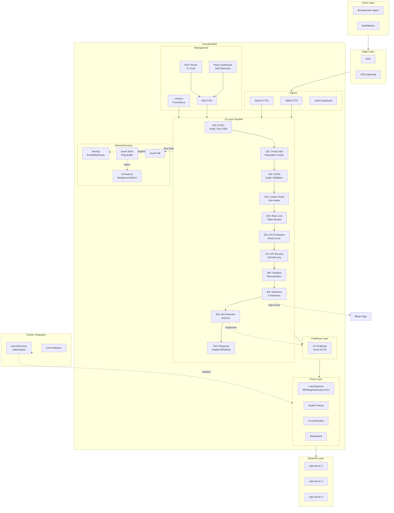
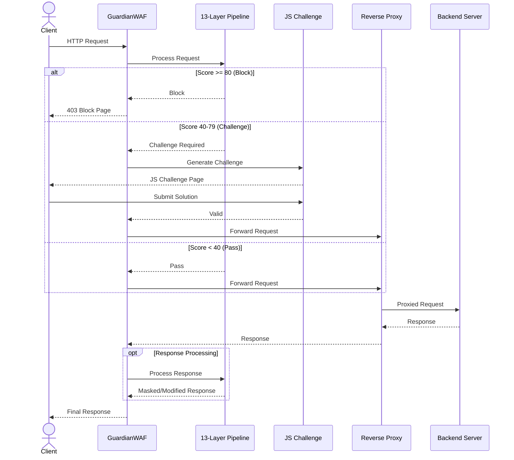
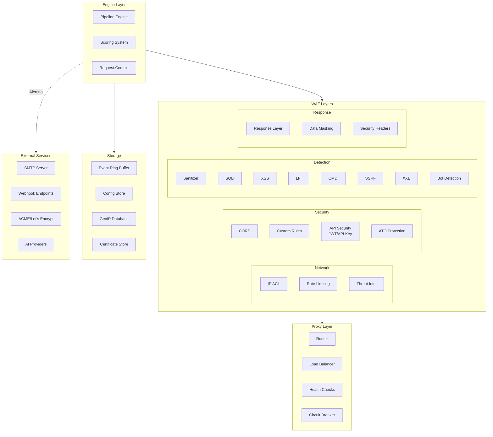
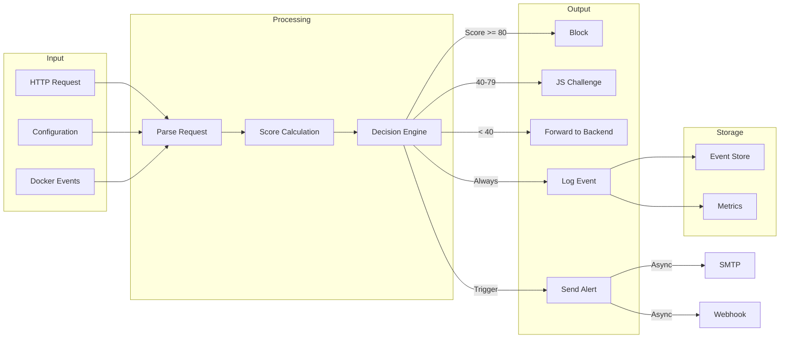
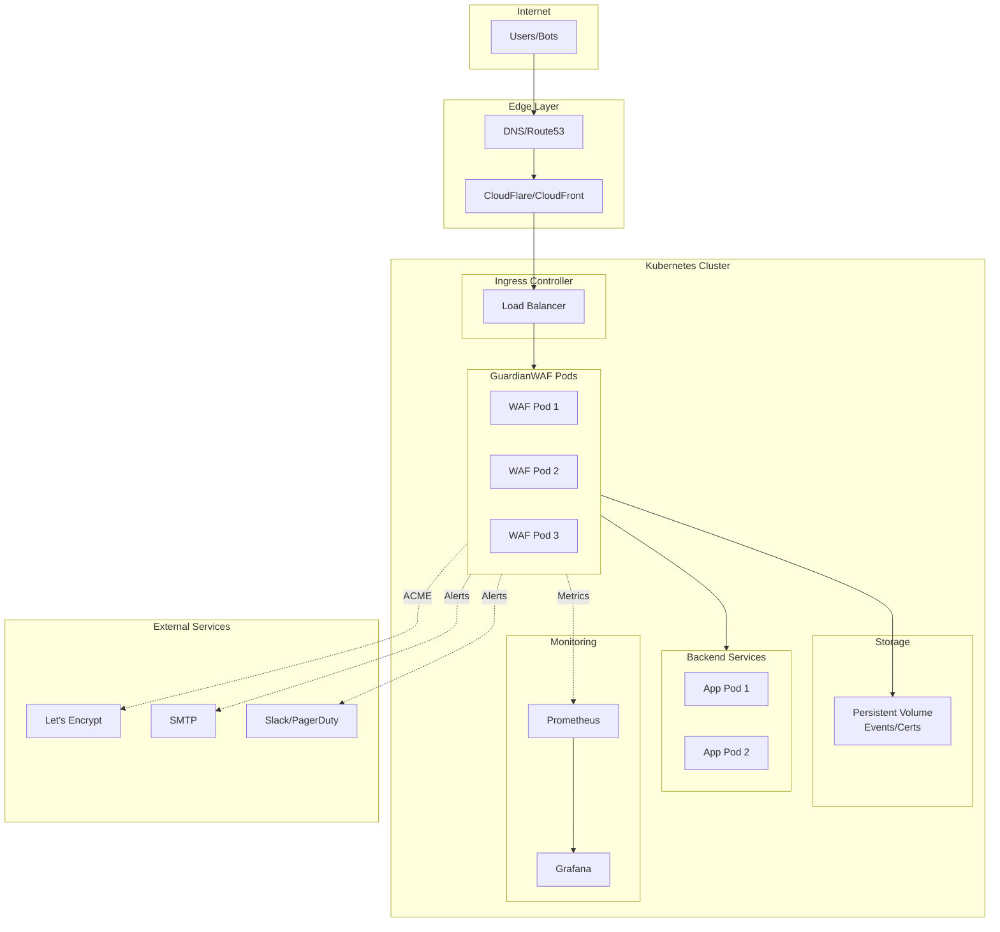
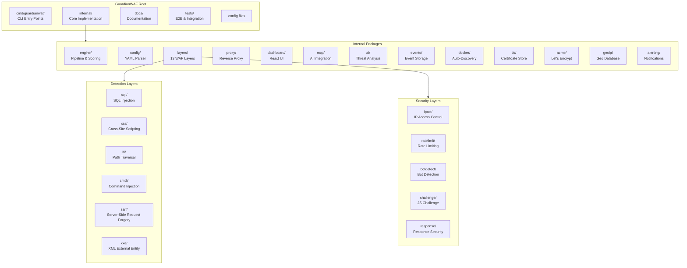

# GuardianWAF Architecture

This document describes the GuardianWAF architecture using Mermaid diagrams.

## System Overview

## Request Flow

## Component Architecture

## Data Flow

## Deployment Architecture

## MCP Integration

```mermaid
flowchart TB
    subgraph AI_Tools["AI Tools"]
        Claude["Claude Code"]
        ClaudeDesktop["Claude Desktop"]
        VSCode["VS Code Extension"]
    end

    subgraph Transport["Transport Layer"]
        STDIO["stdio"]
        SSE["SSE (HTTP)"]
    end

    subgraph MCP_Server["GuardianWAF MCP Server"]
        subgraph Tools["21 Tools"]
            T1["get_stats"]
            T2["get_events"]
            T3["add_blacklist"]
            T4["remove_blacklist"]
            T5["add_whitelist"]
            T6["remove_whitelist"]
            T7["add_ratelimit"]
            T8["remove_ratelimit"]
            T9["add_exclusion"]
            T10["remove_exclusion"]
            T11["set_mode"]
            T12["test_request"]
            T13["get_detectors"]
            T14["get_config"]
            T15["get_alerting_status"]
            T16["add_webhook"]
            T17["remove_webhook"]
            T18["add_email_target"]
            T19["remove_email_target"]
            T20["test_alert"]
            T21["get_top_ips"]
        end

        Handlers["Tool Handlers"]
    end

    subgraph WAF_API["GuardianWAF API"]
        REST["REST Endpoints"]
        Engine["Engine Control"]
    end

    AI_Tools --> Transport
    Transport --> MCP_Server
    Tools --> Handlers
    Handlers --> REST
    REST --> Engine
```

## Directory Structure

---

*For implementation details, see [SPECIFICATION.md](design/SPECIFICATION.md)*
