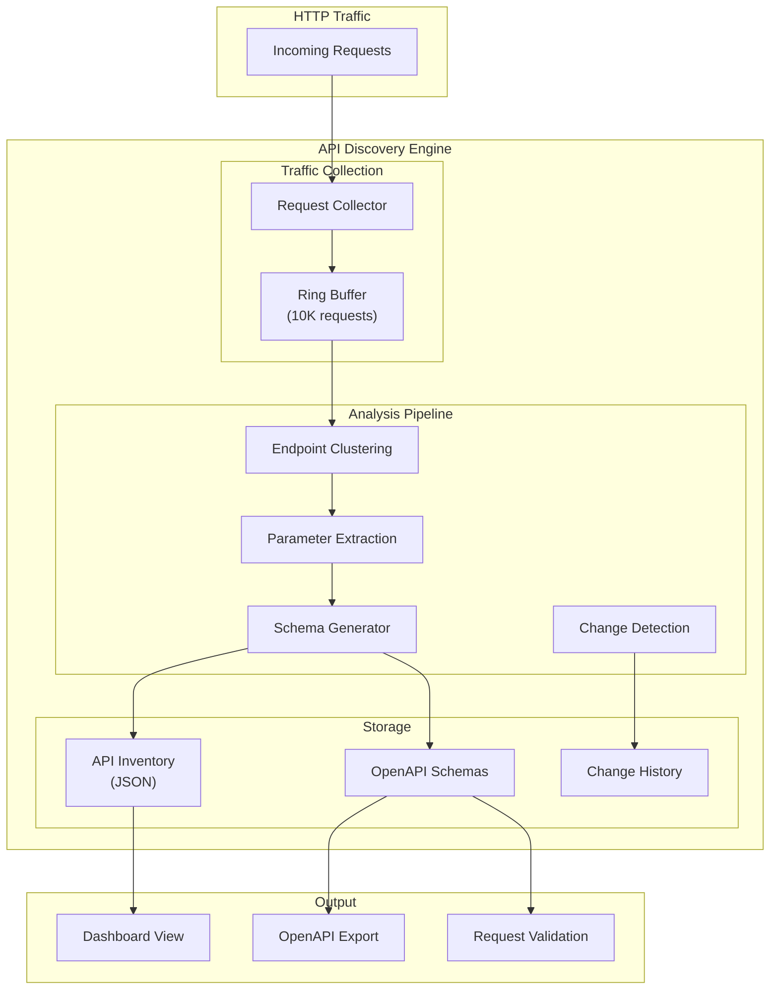
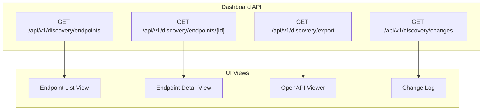

# API Discovery Architecture Design

**Document Version:** 1.0  
**Status:** Draft  
**Author:** GuardianWAF Team  
**Date:** 2026-04-04

---

## Executive Summary

This document describes the architecture for automatic API Discovery in GuardianWAF. The system will analyze HTTP traffic to automatically discover endpoints, generate OpenAPI schemas, and validate requests against those schemas.

**Goals:**
- Automatically discover API endpoints from traffic
- Generate OpenAPI 3.0 specifications
- Detect shadow/zombie APIs
- Validate requests against discovered schemas
- Provide visibility into API inventory

---

## Architecture Overview



---

## Component Design

### 1. Traffic Collector

**Purpose:** Capture and buffer HTTP requests for analysis

```go
// internal/discovery/collector.go
package discovery

// Collector captures HTTP requests for analysis
type Collector struct {
    buffer      *ring.Buffer[Request]
    maxSize     int
    flushPeriod time.Duration
}

type Request struct {
    Timestamp   time.Time
    Method      string
    Path        string
    PathPattern string      // /api/users/{id}
    QueryParams map[string][]string
    Headers     http.Header
    BodySample  []byte      // First 1KB
    ResponseStatus int
    ResponseSize   int
    Latency        time.Duration
}
```

**Key Features:**
- Ring buffer (configurable size, default 10K requests)
- Sampling for high-traffic APIs
- Body sampling (first 1KB for analysis)
- Automatic flush to analyzer

---

### 2. Endpoint Clustering

**Purpose:** Group similar paths into endpoint patterns

**Algorithm:**
```
Input:  ["/api/users/123", "/api/users/456", "/api/orders/abc"]
Output: [
    {Pattern: "/api/users/{id}", Examples: ["/api/users/123", "/api/users/456"]},
    {Pattern: "/api/orders/{id}", Examples: ["/api/orders/abc"]}
]
```

**Implementation:**
```go
// internal/discovery/clustering.go

// Cluster groups paths into endpoint patterns
type Cluster struct {
    Pattern     string      // /api/users/{id}
    PathRegex   *regexp.Regexp
    Examples    []string    // Sample paths
    Count       int         // Total requests
    Methods     map[string]int  // Method distribution
}

// ClusteringEngine performs path clustering
type ClusteringEngine struct {
    minClusterSize    int      // Min requests to form cluster (default: 10)
    similarityThreshold float64 // Path similarity threshold (default: 0.8)
}

func (e *ClusteringEngine) Cluster(paths []string) []Cluster {
    // 1. Tokenize paths
    // 2. Group by token count
    // 3. Within groups, calculate similarity
    // 4. Merge similar paths into clusters
    // 5. Identify dynamic segments (IDs, UUIDs, etc.)
}

// Dynamic segment detection patterns
var dynamicPatterns = []struct {
    Name    string
    Pattern *regexp.Regexp
    Example string
}{
    {"id", regexp.MustCompile(`^\d+$`), "123"},
    {"uuid", regexp.MustCompile(`^[0-9a-f-]{36}$`), "uuid"},
    {"slug", regexp.MustCompile(`^[a-z0-9-]+$`), "my-post"},
    {"hash", regexp.MustCompile(`^[a-f0-9]{8,64}$`), "abc123"},
}
```

---

### 3. Parameter Extraction

**Purpose:** Extract and analyze request/response parameters

```go
// internal/discovery/parameters.go

// Parameter represents a discovered parameter
type Parameter struct {
    Name        string
    Location    string      // "query", "header", "path", "body"
    Type        string      // "string", "integer", "boolean", "array", "object"
    Required    bool
    Enum        []string    // Detected enum values
    Pattern     string      // Detected pattern (regex)
    Example     string      // Example value
    Frequency   int         // How often seen
}

// ParameterAnalyzer extracts parameters from requests
type ParameterAnalyzer struct {
    enumThreshold int  // Min occurrences to consider as enum (default: 5)
}

func (a *ParameterAnalyzer) Analyze(req Request) []Parameter {
    // Extract from:
    // - Query parameters
    // - Path parameters (from clustering)
    // - Headers (common patterns: Authorization, Content-Type, etc.)
    // - Body (JSON structure inference)
}
```

**Type Inference:**
```go
func inferType(value string) string {
    // Try in order:
    if isBoolean(value) return "boolean"
    if isInteger(value) return "integer"
    if isNumber(value) return "number"
    if isArray(value) return "array"
    if isObject(value) return "object"
    return "string"
}
```

---

### 4. Schema Generator

**Purpose:** Generate OpenAPI 3.0 schemas from discovered endpoints

```go
// internal/discovery/schema.go

// SchemaGenerator creates OpenAPI specifications
type SchemaGenerator struct {
    info OpenAPIInfo
}

type OpenAPISpec struct {
    OpenAPI string                     `json:"openapi"`
    Info    OpenAPIInfo                `json:"info"`
    Paths   map[string]PathItem        `json:"paths"`
}

type PathItem struct {
    Get     *Operation `json:"get,omitempty"`
    Post    *Operation `json:"post,omitempty"`
    Put     *Operation `json:"put,omitempty"`
    Delete  *Operation `json:"delete,omitempty"`
    Patch   *Operation `json:"patch,omitempty"`
}

type Operation struct {
    Summary     string              `json:"summary"`
    Parameters  []Parameter         `json:"parameters"`
    RequestBody *RequestBody        `json:"requestBody,omitempty"`
    Responses   map[string]Response `json:"responses"`
}

func (g *SchemaGenerator) Generate(inventory APIInventory) OpenAPISpec {
    spec := OpenAPISpec{
        OpenAPI: "3.0.3",
        Info:    g.info,
        Paths:   make(map[string]PathItem),
    }

    for _, endpoint := range inventory.Endpoints {
        pathItem := g.generatePathItem(endpoint)
        spec.Paths[endpoint.Pattern] = pathItem
    }

    return spec
}
```

---

### 5. Change Detection

**Purpose:** Detect changes in API endpoints

```go
// internal/discovery/changes.go

// ChangeType represents types of API changes
type ChangeType int

const (
    ChangeNewEndpoint ChangeType = iota
    ChangeRemovedEndpoint
    ChangeModifiedEndpoint
    ChangeNewParameter
    ChangeRemovedParameter
    ChangeTypeChange
)

// Change represents an API change
type Change struct {
    Type        ChangeType
    Path        string
    Method      string
    Description string
    Timestamp   time.Time
    Severity    string  // "low", "medium", "high", "critical"
}

// ChangeDetector detects API changes
type ChangeDetector struct {
    previous APIInventory
}

func (d *ChangeDetector) Detect(current APIInventory) []Change {
    changes := []Change{}

    // Compare current vs previous
    // - New endpoints
    // - Removed endpoints
    // - Modified endpoints (new/removed parameters)
    // - Type changes

    return changes
}
```

---

## Data Models

### API Inventory

```json
{
  "version": "1.0",
  "generated_at": "2026-04-04T10:30:00Z",
  "endpoints": [
    {
      "id": "api-users-get",
      "pattern": "/api/users/{id}",
      "path_regex": "^/api/users/[^/]+$",
      "methods": {
        "GET": {
          "count": 1500,
          "response_codes": {
            "200": 1480,
            "404": 20
          }
        },
        "PUT": {
          "count": 300,
          "response_codes": {
            "200": 280,
            "400": 20
          }
        }
      },
      "parameters": [
        {
          "name": "id",
          "in": "path",
          "required": true,
          "type": "integer",
          "pattern": "^\\d+$"
        },
        {
          "name": "include",
          "in": "query",
          "required": false,
          "type": "string",
          "enum": ["profile", "orders", "all"]
        }
      ],
      "first_seen": "2026-04-01T00:00:00Z",
      "last_seen": "2026-04-04T10:30:00Z"
    }
  ],
  "statistics": {
    "total_endpoints": 42,
    "total_requests": 500000,
    "coverage_percentage": 95.5
  }
}
```

---

## Storage Layer

```go
// internal/discovery/storage.go

// Store persists API inventory
type Store interface {
    Save(inventory APIInventory) error
    Load() (*APIInventory, error)
    SaveSchema(spec OpenAPISpec) error
    LoadSchema() (*OpenAPISpec, error)
    SaveChange(change Change) error
    GetChanges(since time.Time) ([]Change, error)
}

// FileStore implements Store using filesystem
type FileStore struct {
    basePath string
}

func (s *FileStore) Save(inventory APIInventory) error {
    // Save to data/api/inventory.json
}

func (s *FileStore) SaveSchema(spec OpenAPISpec) error {
    // Save to data/api/schema.openapi.json
}
```

---

## Request Validation

```go
// internal/discovery/validation.go

// SchemaValidator validates requests against discovered schema
type SchemaValidator struct {
    inventory *APIInventory
}

// ValidateResult contains validation results
type ValidateResult struct {
    Valid   bool
    Errors  []ValidationError
    Score   int  // WAF score contribution
}

type ValidationError struct {
    Field   string
    Type    string  // "missing", "type", "format", "enum"
    Message string
}

func (v *SchemaValidator) Validate(req *http.Request) *ValidateResult {
    // 1. Find matching endpoint
    // 2. Validate method is allowed
    // 3. Validate required parameters
    // 4. Validate parameter types
    // 5. Return validation result with score
}
```

---

## Dashboard Integration



---

## Configuration

```yaml
# config.yaml
discovery:
  enabled: true

  collection:
    buffer_size: 10000
    sample_rate: 1.0  # 1.0 = capture all, 0.1 = 10%
    body_sample_size: 1024
    flush_period: "5m"

  analysis:
    min_cluster_size: 10
    similarity_threshold: 0.8
    learning_period: "24h"
    auto_learning: true

  schema:
    generate_examples: true
    enum_threshold: 5
    pattern_inference: true

  validation:
    enabled: true
    strict_mode: false  # Log violations but don't block
    unknown_endpoint_action: "log"  # "block", "log", "ignore"

  storage:
    path: "/var/lib/guardianwaf/api"
    retention: "30d"
    max_schemas: 10  # Keep last N schema versions
```

---

## Security Considerations

1. **Sensitive Data Handling**
   - Body sampling excludes sensitive content
   - Automatic PII detection and masking
   - Configurable field exclusion

2. **Resource Protection**
   - Memory limits for buffers
   - CPU throttling during analysis
   - Async processing to avoid blocking

3. **Privacy**
   - No actual request data stored long-term
   - Aggregated statistics only
   - GDPR compliance (right to deletion)

---

## Performance Targets

| Metric | Target |
|--------|--------|
| Collection overhead | < 0.1ms per request |
| Analysis latency | < 5s for 10K requests |
| Memory usage | < 100MB for buffer |
| Schema generation | < 1s for 100 endpoints |

---

## Implementation Phases

### Phase 1: Basic Discovery (2 weeks)
- Traffic collection
- Path clustering
- Basic parameter extraction
- Simple inventory

### Phase 2: Schema Generation (2 weeks)
- OpenAPI generation
- Type inference
- Dashboard integration
- Export functionality

### Phase 3: Validation & Changes (1 week)
- Request validation
- Change detection
- Alerting on changes
- Full test coverage

---

## Open Questions

1. **Should we integrate with existing OpenAPI specs?**
   - Import existing specs for validation
   - Compare discovered vs specified

2. **How to handle GraphQL?**
   - Separate discovery mechanism
   - Schema introspection

3. **gRPC support?**
   - Protocol buffer parsing
   - Service discovery

---

*Next Step: Begin Phase 1 implementation - Traffic Collection*
